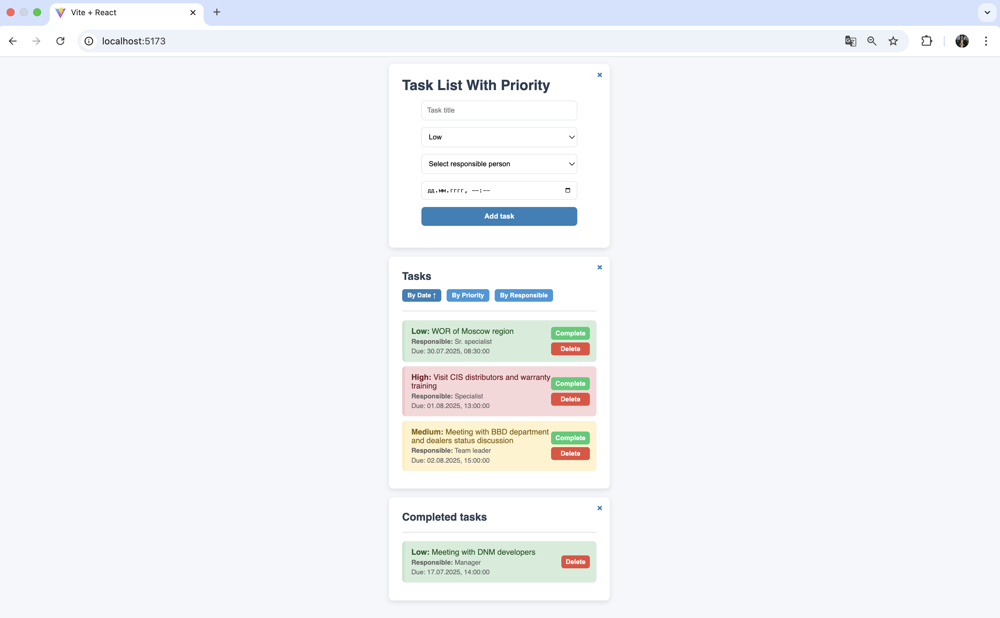

# 📝 Task List With Priority

Это простое приложение на React для управления задачами с поддержкой:

- приоритетов (`High`, `Medium`, `Low`)
- дедлайнов
- ответственных лиц
- сортировки по дате, приоритету и ответственному
- завершения и удаления задач
- свертываемых секций

## 📦 Возможности

- ✅ Добавление задач с приоритетом, дедлайном и ответственным
- ✅ Сортировка по дате, приоритету и ответственному
- ✅ Отображение активных и завершенных задач
- ✅ Завершение и удаление задач
- ✅ Анимированное сворачивание секций

## 🖥️ Интерфейс

- `TaskForm` — форма создания задач
- `TaskList` — список активных задач
- `CompletedTaskList` — список завершённых задач
- `TaskItem` — отображение отдельной задачи
- `Footer` — нижний колонтитул

## 🚀 Установка и запуск

1. Склонируй репозиторий:

   ```bash
   git clone https://github.com/your-username/task-list-app.git
   cd task-list-app
   ```

2. Установи зависимости:

   ```bash
   npm install
   ```

3. Запусти приложение:

   ```bash
   npm run dev
   ```

4. Перейди в браузере по адресу:

   ```bash
   http://localhost:5173/
   ```

### Каждая задача имеет следующую структуру:
```
{
  id: Number,
  title: String,
  priority: "High" | "Medium" | "Low",
  responsible: String,
  deadline: DateTime,
  completed: Boolean
}
```

## 📸 Пример реализации

<table>
  <tr>
    <td></td>
  </tr>

</table>
